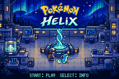
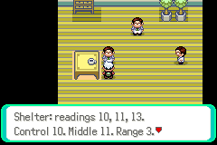

# Pokémon Helix



Learn the nature of the world. Raise a companion whose history matters. Become
a breeder capable of shaping extraordinary lineages.

**Pokémon Helix** is an independent Pokémon Emerald fan project built around
observation, care and discovery. Its direction is a world where Pokémon are rare,
Poké Balls are professional investments, and knowledge grows through places,
people and experiments.

The locally developed game includes:

- A laboratory opening and persistent first companions with individual records.
- Field investigations and practical village work, including remembered shared watering.
- A **V17c candidate** experiment with MIRA and ADA: predict a culture's response,
  use a Culture Reader and Nanomon Medium, then revisit the saved result.
  It does not edit Pokémon DNA.



*Actual emulator captures. Title: historical presentation. Assay: V17c candidate.*

**Status:** V14 is the accepted local default. V15c, V16b and V17c are verified
candidates, not accepted releases. CORAL's birth remains blocked. Native DNA
coverage is Wingull/Pelipper with 40 lifetime records, including abandoned
encounters. General breeding, shared-world multiplayer and a global economy
remain unfinished. RG34XX hardware and its emulator adapter still need validation.

## Try the laboratory model

Install [uv](https://docs.astral.sh/uv/getting-started/installation/), then:

```sh
git clone https://github.com/solanovisitor/pokemon-helix.git
cd pokemon-helix
uv sync --locked --python 3.12
uv run --offline --frozen python -m companion.demo
```

Compare sheltered and exposed conditions using a deterministic, synthetic
assay. No keys or personal files are needed.

**This kickstart runs host tools; a fresh clone does not provide a playable
ROM.** The retained generated packages needed for the full game are absent.

Explore the [docs](docs/README.md), [evidence and limits](docs/verification.md),
[roadmap](docs/roadmap.md), or [make your first contribution](CONTRIBUTING.md).

Built on RHH's `pokeemerald-expansion` and pret's `pokeemerald`. Unaffiliated
with Nintendo, Creatures or Game Freak. See [attribution and licensing
boundaries](docs/attribution.md).
