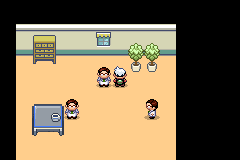
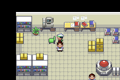
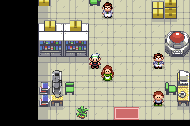

# First native catalog batch

Four static catalog designs replace five existing object positions in the
Research Post and laboratory. No NPC design, position, event or story character
is added. The corrected table keeps its tabletop, cup, legs and open clearance;
its only state is `idle`. The other three designs also retain only `idle`.

| Catalog ID | Map | Existing top-left position | Native canvas |
| --- | --- | --- | --- |
| `world-v2-post_modular_furniture-slate_cobalt` | `HelixResearchPost` | `(2,5)` | 32×32 |
| `wave12-indoor-potted-tree-2026-v12` | `HelixResearchPost` | `(8,1)`, `(9,1)` | 16×32 |
| `world-v2-lab_registration_terminal-mineral_silver` | `HelixLaboratory` | `(3,0)` | 32×32 |
| `world-v2-lab_preparation_terminal-mineral_silver` | `HelixLaboratory` | `(1,9)` | 16×32 |

Separately, four existing lower-layer metatile definitions now use the post's
native opaque peach floor at **66 existing cells**. This joins the table and
plants to the room without changing collision or behavior attributes, map
block data, warps or interactions. These cells are not 66 additional catalog
substitutions. The user preferred this cohesive successor preview; the earlier
proposal remains retained locally as rejected evidence.

## Source and native bindings

All four images come from [`todeschini/helix-assets`](https://huggingface.co/datasets/todeschini/helix-assets),
config `gallery`, revision `d7c825f2d15b0818d549b8367d1054cb53c23713`.
The [selection registry](../rom-source/native-assets-batch1/catalog-selection-v2.json)
links every unchanged original reference and generated PNG by exact URL and
SHA-256, alongside native hashes, uniform scale, occupied bounds, alpha handling,
palette conversion and anchors. [Reference/source/native comparison](../rom-source/native-assets-batch1/comparison.png)
and native derivatives are retained separately. No paid generation or other
inference calls were made; the replacements contain no decorative DNA or real logos.

The integration creates `gTileset_HelixAssetsPost` and `gTileset_HelixAssetsLab`
from the existing `GenericBuilding` and `Lab` secondary tilesets. Only the post's
layout selects the first clone. The laboratory receives a new appended
`HelixAssetsLaboratory_Layout` with byte-identical map/border data, protecting
other maps that share Birch's original laboratory layout. Original tilesets,
existing layout order and all NPC/event/script fields remain unchanged.

The [native manifest](../rom-source/manifest.json) lists every exported result.
Changes comprise the layout registry, laboratory map layout identifier,
`include/tilesets.h`, the three tileset declaration headers, cloned layout bytes
and two cloned secondary tileset directories. The
[public conversion receipt](../rom-source/native-assets-batch1/public-conversion-v2.json)
binds all **46 affected native files**; the complete public bundle has 223 results.

## Reproduction and regression guards

Use the [native source instructions](../rom-source/README.md) to bootstrap the
committed patch/overlay or replay the conversion from the preceding public base.
The V2 converter takes `--table-variation slate_cobalt`, pinned Pillow 11.3.0
and either the four hash-checked remote PNGs or an explicit local catalog export.
It uniformly fits full artwork, records the transparent margins and derives
15-color RGB555 palettes plus transparent index zero. It does not crop functional
parts or stretch an axis independently. The guarded V2 exporter refuses unrelated
public-source edits and leaves public package gates disabled.

The [native-byte verifier](../scripts/verify-native-assets-v2.py) checks all
derived files, unchanged attributes and unrelated tile/palette slots, and decodes
the 4bpp/RGB555 data independently. The
[compiled verifier](../scripts/verify-native-assets-compiled.py) matches ROM
graphics, palette/metatile arrays, header pointers and layout bindings to source.
The [scope guard](../scripts/verify-native-assets-scope-v1.py) compares an independent
pre-integration checkout: **944 map definitions and 2,804 shared original tileset
files** remain unchanged outside the declared map bindings. Pixels outside the
reviewed cells stay exact, and previously opaque scene pixels remain opaque.

Eight [regression tests](../tests/test_native_asset_scope.py) reject leaked map
bindings, reordered layouts, shared-tileset edits, collision/event changes,
out-of-scope pixels and transparent lower backgrounds. CI runs them explicitly:

```sh
uv run --locked --with pillow==11.3.0 python -m unittest discover \
  -s tests -p test_native_asset_scope.py -v
```

All eight passed locally. The ordinary environment passed 247 host tests and
skipped these eight optional-Pillow tests; the dedicated pinned-Pillow step runs
all eight without skips. Host/service and restricted Linux ARM64 smoke checks
passed. Source/host checks do not establish playability in other environments.

## Exact builds and runtime evidence

The development candidate starts from frozen **V19j**, whose 5,925 archived
game files matched the active development source before integration. It excludes
the unrelated V20/V21 science candidates and the older V19e NPC-art checkout.
Pinned Emerald upstream is `36f5cf6271c382d4dc161ba040dd1dd3bc8b2a7f`;
V14 remains the accepted default.

| Development candidate identity | SHA-256 |
| --- | --- |
| ROM | `7afb1ce75fa5bc44dd5a8b27fd68f16efc4c584375647117ffe75b5ec17850cd` |
| ELF | `9a3c85bcc6794b889e3599c6946cfd52e4190f7af2b5f87a8ba88140efd04ed4` |
| Compiled source | `35f63582f0d14ce00ab0381725894daa90a51418220e8f8a6a129d84e439f8f7` |

The exact development ROM passed two isolated native-offline mGBA runs:
**70 captured checkpoints, 17 reachable collision approaches, seven interaction
checks and three ordinary Save/Continue cycles**. All 70 captures (45 distinct
images) were inspected, including travel through unchanged surrounding environments. Table
and plants retain no interaction; both registration bindings retain their
cancelable choice; both preparation bindings retain their existing feedback.
Party, progression, inventory, money, PC items and settings stayed unchanged.
Inputs were explicitly released and both owned emulator processes stopped.
The original test saves remained hash-identical.

The legacy laboratory save initially retains layout 58 and the original art.
Ordinary exit/reentry loads the new layout; ordinary Save/Continue persists
layout 790 and the new art without changing progress. This is a verified
compatibility behavior, not an automatic replacement of already saved layout IDs.
The [sanitized runtime receipt](evidence/native-assets-batch1.json) records exact
build identities, run IDs, screenshot hashes, assertions and limitations.

| Research Post | Registration terminal | Preparation terminal |
| --- | --- | --- |
|  |  |  |

These are unchanged native 240×160 captures from the development ROM.

The public branch starts at `5d0e7d8b580bf164708aa7d4f324b33656a06086`, the merged
V18 source export. Its independent source build and fresh bootstrap roundtrip
passed, with all 223 bundled results verified. Public ROM SHA-256 is
`be7b0ba75e925aa60cbf0fc431f836ebb7f929ba4ea8f73a12bb1cb997b829f3`;
ELF is `37f350352234c60d7d3c28727edbb795c97e3455cc1fdda2e994a651cc9ebfd5`.
That exact public ROM also passed two isolated mGBA 0.10.5 room tests:
**42 captured checkpoints, 17 collision approaches, seven interactions and two
ordinary Save/Continue cycles**. All captures were inspected. The
[public runtime receipt](evidence/native-assets-batch1-public-runtime.json)
separates this result from the earlier
[build-stage receipt](evidence/native-assets-batch1-public-build.json).
The [independent review](evidence/native-assets-batch1-public-review.json)
verified saves, input release and stopped sessions. A second
[pixel comparison](evidence/native-assets-batch1-public-pixel-review.json)
matched all 2,295 opaque prop pixels to the actual captures after native RGB555
expansion, with zero differences.
The [final bundle roundtrip](evidence/native-assets-batch1-final-bundle.json)
also passed after the runtime documentation update: all 223 native results and
30,266 tracked/overlay source files match the tested compilation exactly.

| Public ROM: Research Post | Public ROM: registration | Public ROM: preparation |
| --- | --- | --- |
|  |  |  |

The public gates remain disabled. These tests use fresh deterministic empty
fixtures encoded from zero, with the exact public ELF's save ABI and sector
checksums. Only a synthetic trainer, room/position/layout, native ContinueWarp
and FAST text setting are populated. No existing save, party, genome or accepted
package was copied. Continue uses the engine's ordinary map loading, followed by
ordinary buttons; neither the ROM nor RAM was patched. Initial positions are
Post `(75,2,5,7)`, layout 788, and Lab `(2,5,6,8)`, layout 790. Fixture hashes and
codec provenance are in the runtime receipt; no save bytes are published.

This is rendering/collision/interaction and Save/Continue validation, not proof
of public campaign access or accepted-save migration. Symbols omitted by the
public build are explicitly unavailable in the successor test observer. The
original observer, failed setup attempt and completed development runs remain
retained locally. Inputs were released and both public test processes stopped.
ROMs, saves, accepted packages and personal data remain outside the repository.

## Deferred candidates

The [152-row decision registry](native-asset-candidates.json) preserves the other
catalog candidates. The incubator is deferred because its wider generated
machine could occupy the passable upper-right cell `(12,6)`; the analysis console
needs a complete panel/workbench seam and readability review. Remaining scenery
requires its own native fit, palette, state and map-context checks.

All 76 previously unplaced character designs remain unplaced. The older isolated
20-design/21-position V19e build is not imported. Some catalog characters have
documented directional accessory inconsistencies, so source-art approval alone
does not qualify them for native placement. No NPC direction or walking claim is
made by this object-only batch.
